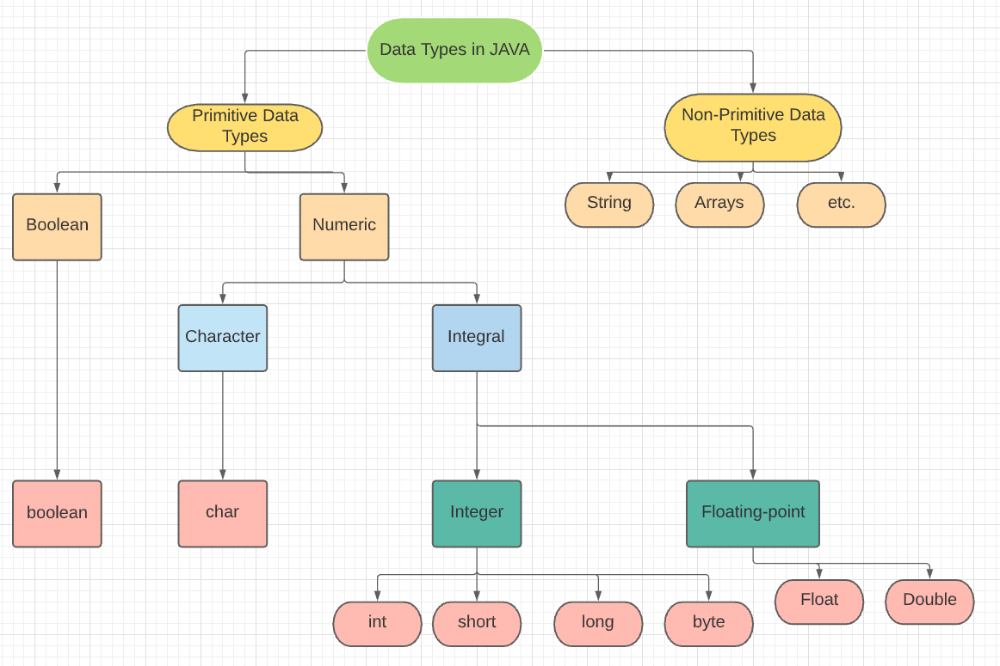

So before knowing what are data types. First let's know what are variable and Constants.

## Variable

Simply, Variable are placeholder for some data values. when we are creating a variable we are just
reserving some memory
locations or reserving some space in memory to store values. In C++, there are different types of variables,eg:

- **int** stores integers such as 7 or -3.
- **float** - stores decimal numbers, such as 7.33 or -3.77.
  etc.

## Constant

As its name suggest **constant**- which does not change, they remain fixed. Basically these are fixed values which
do not change and it must have to be initialized at the time of creation, we can not assign any new values to
it later. That's why these are called **literals**, cuz it can not be modified.

## Data Types

Data types are important because each programming language needs different types of data like integers and
strings, and these data are stored as that data type. Data types are used to define a variable before to use in a
program, its a constrains that a expression, such as variable or a function, might take.
In C++, whenever a variable is defined, the compiler(which compiles source code written in a high-level language(C++)
into a set of machine-language that can be understood by a digital computer's CPU) allocates some memory for that
variable based on their data-type. It has some types:

