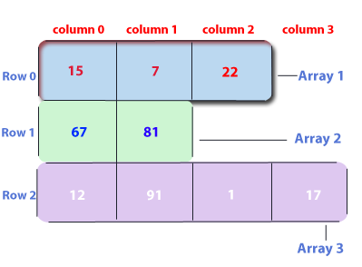

> A jagged array is an array of arrays such that member arrays can be of different sizes.
We can create a 2-D array but with a variable number of columns in each row. 
These types of arrays are also known as Jagged arrays.



#### Declaration and Initialization of Jagged array :
##### Syntax : 
data_type array_name[][] = new data_type[n][];  //n: no. of rows

```java
    array_name[] = new data_type[n1] //n1= no. of colmuns in row-1
    array_name[] = new data_type[n2] //n2= no. of colmuns in row-2
    array_name[] = new data_type[n3] //n3= no. of colmuns in row-3
                                       .
                                       .
                                       .
    array_name[] = new data_type[nk]  //nk=no. of colmuns in row-n
```


#### Alternative, ways to Initialize a Jagged array :
```java
    int arr_name[][] = new int[][]  {
        new int[] {15, 7, 22},
        new int[] {67, 81},
        new int[] {12, 91, 1, 17}
    };
```
                                      
OR   
```java
    int[][] arr_name = {
        new int[] {15, 7, 22},
        new int[] {67, 81},
        new int[] {12, 91, 1, 17}
    };
```
 OR  
```java
    int[][] arr_name = {
        {15, 7, 22},
        {67, 81},
        {12, 91, 1, 17}
    };
```

```java
class Main {
    public static void main(String[] args)
    {
        // Declaring 2-D array with 2 rows
        int arr[][] = new int[2][];
 
        // Making the above array Jagged
 
        // First row has 3 columns
        arr[0] = new int[3];
 
        // Second row has 2 columns
        arr[1] = new int[2];
 
        // Initializing array
        int count = 0;
        for (int i = 0; i < arr.length; i++)
            for (int j = 0; j < arr[i].length; j++)
                arr[i][j] = count++;
 
        // Displaying the values of 2D Jagged array
        System.out.println("Contents of 2D Jagged Array");
        for (int i = 0; i < arr.length; i++) {
            for (int j = 0; j < arr[i].length; j++)
                System.out.print(arr[i][j] + " ");
            System.out.println();
        }
    }
}
```

##### Output
Contents of 2D Jagged Array
0 1 2 
3 4 

Following is another example where i’th row has i columns, i.e., the first row has 1 element, the second row has two elements and so on.

```java
// Another Java program to demonstrate 2-D jagged
// array such that first row has 1 element, second
// row has two elements and so on.
class Main {
    public static void main(String[] args)
    {
        int r = 5;
 
        // Declaring 2-D array with 5 rows
        int arr[][] = new int[r][];
 
        // Creating a 2D array such that first row
        // has 1 element, second row has two
        // elements and so on.
        for (int i = 0; i < arr.length; i++)
            arr[i] = new int[i + 1];
 
        // Initializing array
        int count = 0;
        for (int i = 0; i < arr.length; i++)
            for (int j = 0; j < arr[i].length; j++)
                arr[i][j] = count++;
 
        // Displaying the values of 2D Jagged array
        System.out.println("Contents of 2D Jagged Array");
        for (int i = 0; i < arr.length; i++) {
            for (int j = 0; j < arr[i].length; j++)
                System.out.print(arr[i][j] + " ");
            System.out.println();
        }
    }
}
```
##### Output
Contents of 2D Jagged Array
0 
1 2 
3 4 5 
6 7 8 9 
10 11 12 13 14 


### Applications

After having learnt about Jagged Arrays, you must be wondering, where you should use them? Well, continue reading....

A matrix is typically stored as a 2D arrays. It may be called as a "dense" representation. It's called dense because it stores each and every element of the array. But in some cases many elements of the array are 0 (or perhaps some other value) and it doesn't make sense to store them explicitly. These are called "sparse" matrix.

Now coming to the applications and uses-
- A lot of sparse matrix representations use a small number of 1D arrays.
Really jagged arrays are definitely useful in situations where you don't want each 1D array to have the same length. Jagged arrays also make it somewhat easier to swap out entire "rows".
- It should be noted that, jagged arrays usually have better performance than multidimensional arrays.
- When using jagged arrays you can easily perform operations like row swap and row resize. Maybe in some cases usage of multidimensional arrays will be more safe, but jagged arrays should be used instead of multidimensional when you use it for analysis purposes.